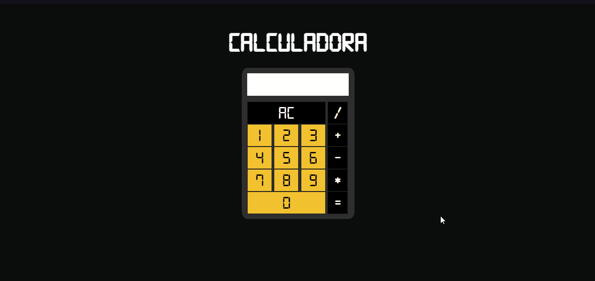

# Calculadora 🔢

## Introdução 👾
* Projeto desenvolvido com o intuito de estudo em JS;
* Tecnologias utilizadas: HTML, CSS e Javascript;
* Inspirado em [Projetos para Iniciantes](https://github.com/florinpop17/app-ideas).
#
<h1></h1>